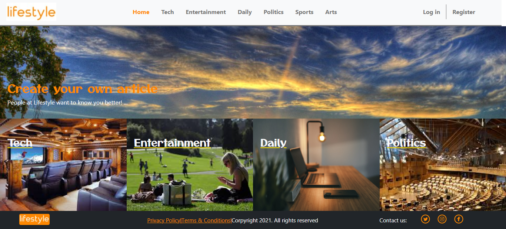
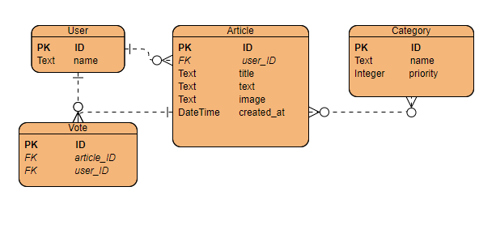

# Lifestyle Capstone

> This project is my final test for Ruby on Rails module, where I'll build an articles website to show my skills with Ruby, its gems, databases and the MVC model. 

The website is designed as follows:
- A Navbar with a series of links to all categories, the "company's" logo and a variable section to the outmost right.
    - Said section shows 'Sign Up' and 'Log In' options if not logged in and 'Sign Out' and 'Post' otherwise.
- A footer with legal Corpiright content, links to Terms and Services and Privacy policy, another company logo and a set of social media links.

Both elements are present in most views, where they would be needed.

- Homepage
    - A full-width featured article. This article will always be the most voted one.
    - Four blocks with links to the four categories of highest priority.
- Category page 
    - Articles tile the website from beginning to end, taking turns showing their image on top or bottom of the content.
    - The article displays it's title, a truncated body, the author's name and a votes count.
    - There is a button to vote each article, only if you are not the author.
- User Log In
    - Contains a simple form asking for a username, and a submit button.
    - Contains a link to return to the homepage and another to sign up.
- User Sign Up
    - Contains a simple form asking for a username, and a submit button.
    - Contains a link to return to the homepage and another to log in.
- Article creation (Post button on navbar)
    - Contains a form asking for a title and a text to display
    - Contains a link to return to the homepage.
    - If the submitted content passes the validations, you are taken to another page listing the available categories and either 'add' or 'remove' as options.
    - Said page will only allow you to proceed if you have chosen at least one category, by showing a 'Done' link.
    - On clicking this link, you are taken to the first category you picked for your article, and it will be displayed first.

The next image displays the basic design of our database's Object Relational Model

Currently, the many-to-many relationship between Article and Category models is driven by a has_many :through relationship using Categorization as a join table.

## Built With

- Ruby 3.0.1
    - Rails 6.1.4 (Web application engine)
    - Bootstrap gem (stylesheet for each view)
    - Rubocop gem (linters)
    - PostgreSQL gem (database)
- Heroku 

## Live Demo

[Live Demo Link](still-taiga-55928.herokuapp.com)

## Getting Started

To get a local copy up and running follow these simple example steps.

### Prerequisites
   - Ruby (3.0.1)
   - Rails (6.1.4)
### Setup
   - Clone this repo to your local computer with `git clone https://github.com/JuliCarracedo/Lifestyle-capstone.git ` on a folder of your preference
   - Move to the application's directory using `cd Lifestyle-capstone`
   
### Install
- Run `bundle install` to install all Ruby gems required
- Run `rails webpacker:install` to ensure Webpacker is properly set up
### Usage
- Run `rails s` 
### Run tests
There are unit tests available for User, Article and Category models. Votes was excluded since it's behaviour is very limited. Categorization was excluded because it only is a through table relating articles to categories.

Run the available unit tests with `rspec`

## Author

👤 **Author1**

- GitHub: [JuliCarracedo](https://github.com/JuliCarracedo)
- Twitter: [@CarracedoTrigo](https://twitter.com/CarracedoTrigo)
- LinkedIn: [Julian Carracedo](https://linkedin.com/in/julian-carracedo/)

## 🤝 Contributing

Contributions, issues, and feature requests are welcome!

## Show your support

Give a ⭐️ if you like this project!

## Acknowledgments

- This project is based on [this template](https://www.behance.net/gallery/14554909/liFEsTlye-Mobile-version) designed by [Nelson Sakowa on Behance](https://www.behance.net/sakwadesignstudio)

## 📝 License

This project is MIT licensed.
